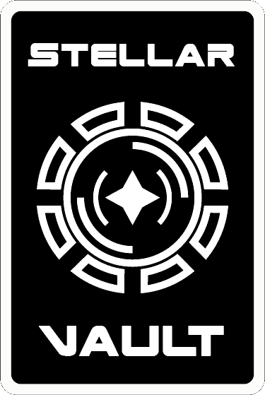

    

## Hello Everyone 👋

We have 2 games as of now: Niva a platformer hardcore game, which is on Steam and Hexatak which is a turn by turn tactical game where you can play with your friends.

We're gonna add more few games in the future so stay linked 😉!

<!--If you have a question or a problem, check the read me of each game with the description and if it's not enough contact us on discord : at limule_rl or imnotstealth.-->

Thanks for playing and being interested in our games.

<h2>🚀 Languages That We Can Use</h2>

    
<h2>🚀 Tools That We Can Use</h2>

<h2>⚡️ Where to find us</h2>

<!--
**LimuleGit/LimuleGit** is a ✨ _special_ ✨ repository because its `README.md` (this file) appears on your GitHub profile.

Here are some ideas to get you started:

- 🔭 I’m currently working on ...
- 🌱 I’m currently learning ...
- 👯 I’m looking to collaborate on ...
- 🤔 I’m looking for help with ...
- 💬 Ask me about ...
- 📫 How to reach me: ...
- 😄 Pronouns: ...
- ⚡ Fun fact: ...
-->
<!--

**Here are some ideas to get you started:**

🙋‍♀️ A short introduction - what is your organization all about?
🌈 Contribution guidelines - how can the community get involved?
👩‍💻 Useful resources - where can the community find your docs? Is there anything else the community should know?
🍿 Fun facts - what does your team eat for breakfast?
🧙 Remember, you can do mighty things with the power of [Markdown](https://docs.github.com/github/writing-on-github/getting-started-with-writing-and-formatting-on-github/basic-writing-and-formatting-syntax)
-->
